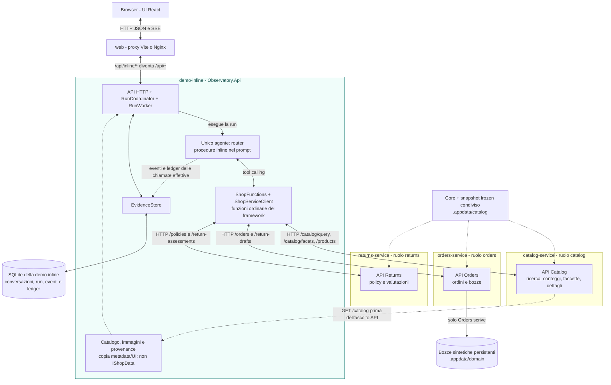
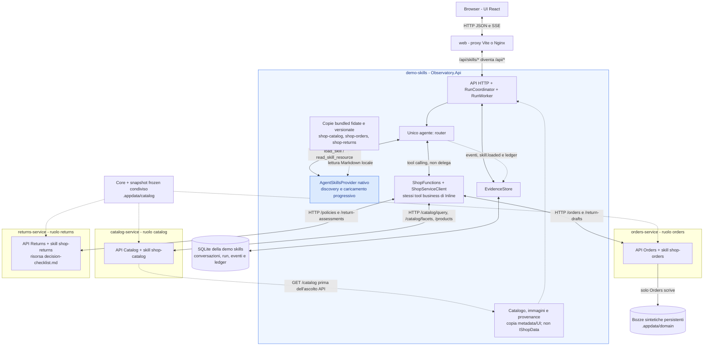
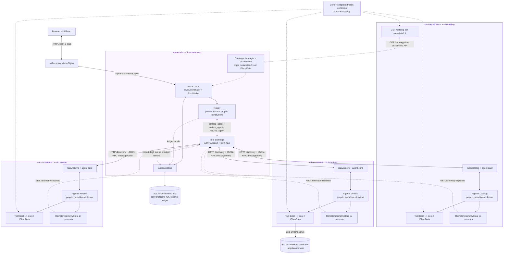

# Architettura delle tre demo

Tre percorsi distinti: **Inline**, **Agent Skills** e **A2A**. Tutti usano
Catalog, Orders e Returns come servizi separati. Sono tre istanze dello
stesso progetto `Observatory.AgentHost`, configurate con
`Agents:Role=catalog|orders|returns`, non tre copie di codice.

Gli schemi mostrano dipendenze e percorsi possibili, non una run gia eseguita:
il router usa solo i tool o gli specialisti necessari alla richiesta.

## Differenze a colpo d'occhio

| Aspetto | Inline | Agent Skills | A2A |
| --- | --- | --- | --- |
| Agenti AI | Solo router nell'API | Solo router nell'API | Router nell'API; uno specialista nel servizio di ciascun ruolo |
| Accesso del router al dominio | Tool ordinari -> HTTP business | Gli stessi tool ordinari -> HTTP business | Tool di delega -> SDK A2A JSON-RPC su HTTP |
| Procedure | Inline nel prompt del router | Tre pacchetti Markdown caricati on demand dal provider nativo del router | Prompt inline del router e degli specialisti |
| Modello/tool loop specialistico | Assente | Assente | Proprio `IChatClient` e ciclo tool per ogni specialista invocato |
| Skill native | Assenti | `shop-catalog`, `shop-orders`, `shop-returns` | Assenti; `AgentCard.Skills` e solo metadata di capacita |
| `capabilities.agentNames` | `["router"]` | `["router"]` | `["router","catalog","orders","returns"]` |
| Risposta finale | Router | Router | Router |

Skills organizza le istruzioni, A2A realizza la delega tra veri agenti.
Non c'e delega `AsAIFunction` a specialisti in-process in Inline o Skills.
Il confronto con A2A cambia anche gli agenti e le possibili chiamate al
modello: non misura il solo overhead di rete a parita di inferenze.

### Come leggere gli schemi

- I riquadri `demo-*` e `*-service` sono confini di processo o container.
- Ogni agente disegnato e un `ChatClientAgent` di Microsoft Agent Framework.
  Una API business o un documento skill **non** e un agente AI.
- Le chiamate d'inferenza, omesse nei grafi, usano Azure OpenAI LIVE.
  Ogni invio richiede configurazione, deployment, capacita, prezzi e consenso
  di spesa; l'avvio e la scelta del grafo non invocano modelli.
- Gli archi HTTP indicano rete reale. Le frecce tratteggiate distinguono
  metadata, istruzioni ed evidenze dal percorso principale.
- I file SQLite sono separati per demo e conservano evidenze. I servizi
  condividono fixture Core e snapshot frozen, **non database di negozio
  indipendenti**; soltanto Orders scrive bozze nello stato persistente.

## Inline: un router, procedure nel prompt, tool HTTP

1. L'API registra la richiesta e il worker esegue il router.
2. Il router sceglie tool ordinari come `get_order` o `assess_return`.
   Il framework invoca funzioni C# che effettuano HTTP al servizio competente.
3. Il servizio applica le validazioni di dominio, senza inferenza
   specialistica. Il router usa i risultati per comporre la risposta.

I servizi espongono anche A2A e il proprio pacchetto skill, ma questo percorso
non li usa. Non ci sono agenti Catalog/Orders/Returns nel processo API.

## Agent Skills: lo stesso router HTTP, istruzioni progressive

1. Il router riceve istruzioni di sicurezza e discovery delle skill.
2. `load_skill` carica il relativo `SKILL.md`; `read_skill_resource` puo
   aggiungere, per Returns, `references/decision-checklist.md`.
3. Il router invoca direttamente gli stessi tool HTTP di Inline. Il
   caricamento di una skill non delega a un altro agente.

Il provider legge copie **bundled fidate** degli stessi tre pacchetti
pubblicati dai servizi via `/skills/shop-{role}/SKILL.md`. Non scarica
Markdown dalla rete durante la run e non esegue script. Le copie sono
distribuite e versionate insieme al codice; non esiste una skill `shop-router`.
La checklist aggiuntiva appartiene soltanto al pacchetto Returns.

Le skill contengono procedure, non la fonte autorevole di prezzi, ordini
o policy. I fatti arrivano dalle API business. Il caricamento avviene su
richiesta del router, non eseguendo scenari o modelli allo startup.

## A2A: router e tre servizi con veri agenti remoti

1. Il tool di delega usa l'origine configurata per il ruolo e verifica
   `GET /a2a/{role}/.well-known/agent-card.json`.
2. L'SDK ufficiale invia `message/send` JSON-RPC a `/a2a/{role}` di quel
   servizio. Solo lo specialista configurato puo essere eseguito.
3. Lo specialista ha un proprio client di inferenza, prompt inline e ciclo
   tool. Usa le stesse operazioni Core delle sue API business, localmente
   al servizio. Non carica `AgentSkillsProvider` o Markdown nativo.
4. Il risultato di dominio torna al router. Gli eventi remoti sono raccolti
   separatamente da `/telemetry/{runId}?invocationId=...` sull'origine del
   ruolo e poi persistiti dall'API, mai inseriti nel messaggio al modello.

I tre specialisti sono quindi **tre processi/container distinti**, con un
solo progetto e un'unica immagine AgentHost riutilizzata. Non e una REST API
personalizzata ribattezzata A2A. Le `Skills` presenti nella Agent Card sono
metadata di capacita del protocollo, non il provider nativo della demo Skills.
Le API business e i file skill restano esposti dai servizi, anche se il
percorso A2A usa i loro agenti e non carica quei file.

## Contratti e confini di fiducia

Le origini sono `Agents:Endpoints:catalog`, `Agents:Endpoints:orders` e
`Agents:Endpoints:returns`. Non includono percorsi `/a2a` o `/api`.

| Servizio | Endpoint business | Tool AI corrispondente |
| --- | --- | --- |
| Catalog | `GET /catalog` | Nessuno: snapshot completo soltanto per metadata/UI |
| Catalog | `GET /products?query=&maxPrice=&take=` | `search_products` |
| Catalog | `GET /catalog/query?query=&category=&color=&maxPrice=&inStockOnly=&take=` | `query_catalog` |
| Catalog | `GET /catalog/facets` | `get_catalog_facets` |
| Catalog | `GET /products/{productId:int}` | `get_product` |
| Orders | `GET /orders/{orderId}` | `get_order` |
| Orders | `POST /return-drafts` con `{orderId,reason}` | `create_return_draft` |
| Returns | `GET /policies` | `get_policies` |
| Returns | `POST /return-assessments` con `{orderId,reason}` | `assess_return` |

Ogni servizio mappa soltanto le proprie API business, il proprio
`/a2a/{role}` con agent card e `/skills/shop-{role}/SKILL.md`.
Returns aggiunge `/skills/shop-returns/references/decision-checklist.md`.
Inline/Skills espongono al router tutti i tool business; A2A espone al router
solo i tre tool di delega e a ogni specialista solo i tool del proprio ruolo.

- `X-Observatory-Customer-Id` viene impostato dal backend sull'identita
  fidata, non da un argomento generato dal modello o da un header UI.
- `X-Observatory-Confirm-Action=true` viene impostato dal backend solo dopo
  consenso esplicito validato. Orders rivaluta l'ammissibilita prima di
  creare una bozza; testo del modello e semplice richiesta HTTP non bastano.
- `X-Observatory-A2A-Key` autentica **tutti** gli endpoint backend non-health
  quando `Agents:AllowRemote=true`: business, skill, discovery, A2A,
  telemetria e indice. Solo `GET /health` e `GET /alive` sono esenti.
- A2A trasporta customer/consenso e configurazione nella metadata fidata
  della richiesta backend, non nel testo di dominio affidato al modello.
- Il browser usa soltanto le API delle demo attraverso `web`; non riceve
  il segreto e non chiama direttamente i servizi.

Le immagini sono URL pubblici per la UI: i tool AI restituiscono
`ProductFact` e aggregati senza immagini. `query_catalog` conta tutti i
modelli e pezzi corrispondenti ai filtri prima di applicare `take` agli
esempi. `get_catalog_facets` espone categorie e colori testuali reali.
I colori derivano da titolo, descrizione e tag, non da analisi delle immagini;
un prodotto multicolore puo appartenere a piu faccette.
Le bozze sono sintetiche, non eseguono
rimborsi o pagamenti.

`ToolTransport=direct` distingue funzioni del framework da MCP, **non**
dominio in-process. Le chiamate business HTTP di Inline/Skills sono reali;
in A2A sono reali discovery, delega e raccolta telemetria HTTP. MCP non e
implementato e non va disegnato come un quarto percorso disponibile.

## Avvio, persistenza e osservabilita comuni

Un solo Aspire AppHost avvia `web`, `demo-inline`, `demo-skills`, `demo-a2a`,
`catalog-service`, `orders-service`, `returns-service`. Tutte le API ricevono
le tre origini dinamiche e attendono la salute di tutti i servizi.
Il proxy conserva `/api/inline`, `/api/skills`, `/api/a2a`.

A processi, l'accesso ai servizi e loopback-only. Nei container, Aspire
propaga il segreto generato e `Agents:AllowRemote=true` ai soli backend.
Il publish dell'immagine AgentHost precede quello dell'immagine API per
evitare scritture concorrenti negli output condivisi; ogni immagine e
riutilizzata da tre istanze.

### Inizializzazione di base, non esecuzione degli scenari

1. I servizi inizializzano `ShopData` e le fixture Core prima dell'ascolto.
   `.appdata\catalog\products.snapshot.json` viene copiato atomicamente
   dallo snapshot bundled solo se manca. Una copia esistente e validata e
   riutilizzata, senza alterare acquisizione/hash o cancellare bozze.
2. Le API non inizializzano un dominio locale: prima dell'ascolto caricano
   catalogo, immagini e provenance tramite `GET /catalog` di Catalog.
   Questa copia serve a UI e metadata delle run, non ai tool del modello.
3. Gli scenari sono definizioni locali. Non si crea alcuna conversazione
   o run, non si invocano modelli e non si scaricano dati da Internet.
   Il fetch interno HTTP verso Catalog non e un seed o uno scenario.

I servizi condividono lo snapshot e le fixture deterministiche della
libreria Core. Solo Orders scrive le bozze in `.appdata\domain`; non ci
sono database di dominio separati per servizio. Nei container questi
percorsi sono `/state/catalog` e `/state/domain`. Uno snapshot non valido
interrompe lo startup, senza fallback silenzioso.

Ogni API conserva solo il proprio file `.appdata\{tecnologia}\observatory.sqlite`,
montato come `/state/{tecnologia}/observatory.sqlite` nei container.
La separazione di SQLite riguarda conversazioni, run, timeline e ledger,
non il catalogo o gli ordini del negozio.

Ci sono due destinazioni distinte delle evidenze:

- `EvidenceStore`/SQLite della demo: eventi, ledger per-call, UI, SSE, replay
  ed export, inclusi gli eventi remoti importati in A2A.
- OpenTelemetry/OTLP: span, log e metriche nella dashboard Aspire. Non
  sostituisce SQLite e non va sommato al ledger come ulteriore fatturazione.

SSE trasmette eventi applicativi e una risposta bufferizzata, non token
streaming del provider. Token e costo sono mostrati solo quando disponibili
dall'usage del provider e dalle tariffe configurate. Questi schemi non
costituiscono un report di test o benchmark gia completati.

## Riferimenti nel codice

- [Orchestrazione Aspire](src/Observatory.AppHost/AppHost.cs)
- [Router, tool ordinari, specialisti A2A e provider Skills](src/Observatory.Agents/ObservatoryAgentRuntime.cs)
- [Istruzioni e profili](src/Observatory.Agents/AgentPrompts.cs)
- [Pacchetti skill dei servizi](src/Observatory.Agents/Skills)
- [Client HTTP business](src/Observatory.Agents/ShopServiceClient.cs)
- [Client A2A e importazione telemetria](src/Observatory.Agents/A2ATransport.cs)
- [Host configurato per ruolo](src/Observatory.AgentHost/AgentHostApplication.cs)
- [API business e file skill per ruolo](src/Observatory.AgentHost/BusinessEndpoints.cs)
- [Client di inferenza e cattura logica](src/Observatory.Agents/ModelProviderFactory.cs)
- [Tool e validazioni](src/Observatory.Agents/ShopFunctions.cs)
- [Fixture Core e inizializzazione snapshot](src/Observatory.Core/ShopData.cs)
- [Startup API](src/Observatory.Api/Program.cs)
- [Caricamento metadata da Catalog](src/Observatory.Api/RemoteShopCatalog.cs)
- [Coordinamento e worker](src/Observatory.Api/RunProcessing.cs)
- [Persistenza delle evidenze](src/Observatory.Api/EvidenceStore.cs)
- [OpenTelemetry condiviso](src/Observatory.ServiceDefaults/Extensions.cs)
