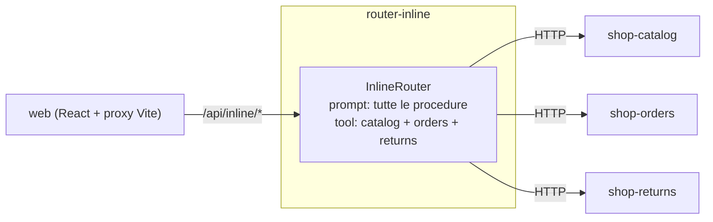
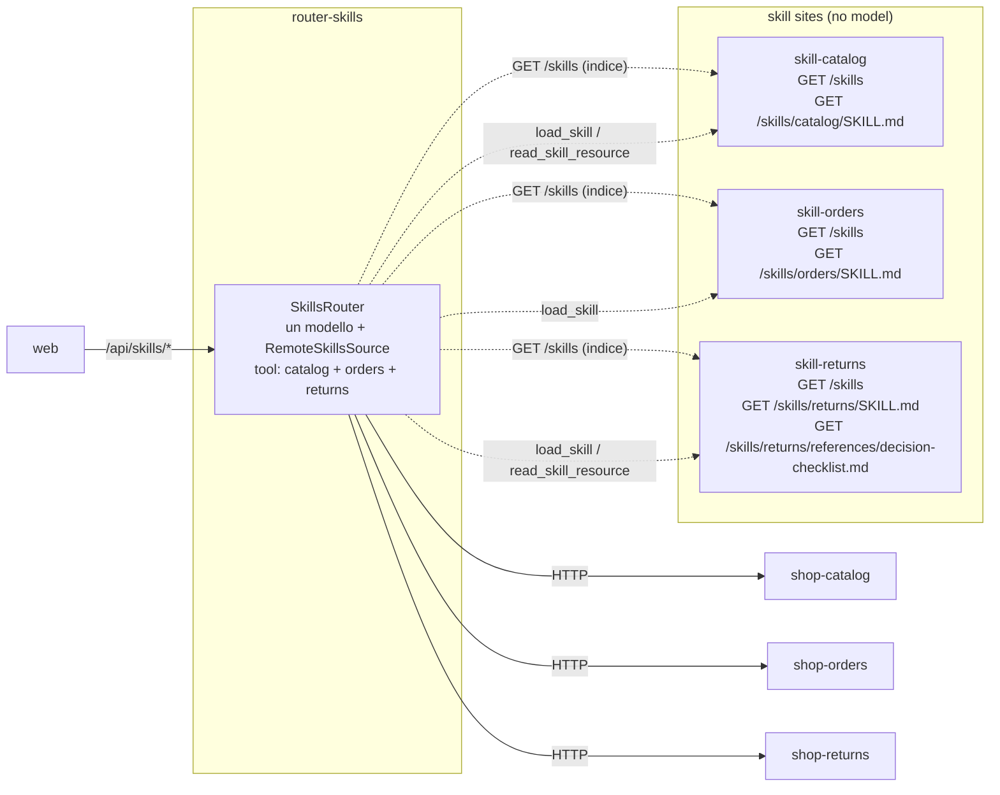
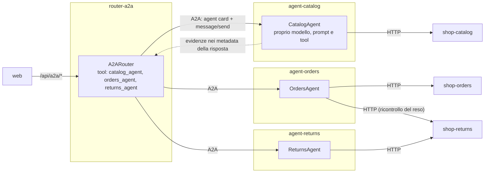

# Architettura delle tre demo

Tre percorsi distinti per lo stesso assistente del negozio: **Inline**,
**Agent Skills** e **A2A**. Ogni componente e un processo .NET separato,
avviato e collegato da Aspire. Ogni agente ha la propria API, il proprio
modello, il proprio prompt e i propri tool.

Gli schemi mostrano dipendenze e percorsi possibili, non una run gia eseguita:
il router usa solo i tool o gli specialisti necessari alla richiesta.

## I dodici processi

| Risorsa Aspire | Progetto | Modello | Chiama |
| --- | --- | --- | --- |
| `shop-catalog` | [Observatory.Shop.Catalog](src/Shop/Observatory.Shop.Catalog) | No | - |
| `shop-orders` | [Observatory.Shop.Orders](src/Shop/Observatory.Shop.Orders) | No | - |
| `shop-returns` | [Observatory.Shop.Returns](src/Shop/Observatory.Shop.Returns) | No | - |
| `agent-catalog` | [Observatory.Agent.Catalog](src/Agents/Observatory.Agent.Catalog) | Si | `shop-catalog` |
| `agent-orders` | [Observatory.Agent.Orders](src/Agents/Observatory.Agent.Orders) | Si | `shop-orders`, `shop-returns` |
| `agent-returns` | [Observatory.Agent.Returns](src/Agents/Observatory.Agent.Returns) | Si | `shop-returns` |
| `skill-catalog` | [Observatory.Skill.Catalog](src/Skills/Observatory.Skill.Catalog) | No | - |
| `skill-orders` | [Observatory.Skill.Orders](src/Skills/Observatory.Skill.Orders) | No | - |
| `skill-returns` | [Observatory.Skill.Returns](src/Skills/Observatory.Skill.Returns) | No | - |
| `router-inline` | [Observatory.Router.Inline](src/Routers/Observatory.Router.Inline) | Si | le tre `shop-*` |
| `router-skills` | [Observatory.Router.Skills](src/Routers/Observatory.Router.Skills) | Si | le tre `skill-*` e le tre `shop-*` |
| `router-a2a` | [Observatory.Router.A2A](src/Routers/Observatory.Router.A2A) | Si | i tre `agent-*` (e `shop-*` solo per i dati della UI) |

I nomi sono anche gli indirizzi: i client usano `http://shop-orders` o
`http://agent-orders` e la **service discovery di Aspire** li risolve.
Nessun URL, ruolo o tecnologia si configura a mano. Il grafo completo e in
[AppHost.cs](src/Observatory.AppHost/AppHost.cs).

## Differenze a colpo d'occhio

| Aspetto | Inline | Agent Skills | A2A |
| --- | --- | --- | --- |
| Agenti con modello | `router-inline` | `router-skills` | `router-a2a` e tre `agent-*` |
| Accesso al dominio | Tool HTTP verso le API | Gli stessi tool HTTP | Delega A2A; ogni agente usa i tool HTTP della propria API |
| Procedure | Tutte nel prompt del router | Skill native caricate on demand | Nel prompt di ogni agente |
| Skill native | Assenti | `catalog`, `orders`, `returns` da `skill-catalog`, `skill-orders`, `skill-returns` | Assenti; `AgentCard.Skills` e metadata di protocollo |
| `capabilities.agentNames` | `["router"]` | `["router"]` | `["router","catalog","orders","returns"]` |

I tool HTTP sono gli stessi ovunque: stesso nome, descrizione e schema.
Cambia solo quale agente li usa. Skills organizza le istruzioni, A2A realizza
la delega fra veri agenti. Il confronto con A2A cambia anche numero di agenti
e chiamate al modello: non misura il solo overhead di rete.

### Come leggere gli schemi

- Ogni riquadro e un processo separato con il proprio `Program.cs`.
- Ogni agente e un `ChatClientAgent` di Microsoft Agent Framework. Una API di
  business o un documento skill **non** e un agente.
- Le chiamate al modello, omesse nei grafi, usano Azure OpenAI LIVE e
  richiedono configurazione, prezzi e consenso di spesa.
- Le frecce tratteggiate sono dati, istruzioni ed evidenze.

## Inline: un router, procedure nel prompt, tool HTTP

Il router sceglie tool come `get_order` o `assess_return`; ogni tool e una
chiamata HTTP all'API competente, che applica le regole di dominio senza
inferenza. Codice: [InlineRouter.cs](src/Routers/Observatory.Router.Inline/InlineRouter.cs).

## Agent Skills: lo stesso router HTTP, istruzioni progressive

Ogni skill e pubblicata dal proprio skill site in
[src/Skills](src/Skills). Il router legge solo l'indice in anticipo via
service discovery (`http://skill-*`), poi scarica `SKILL.md` e le risorse
Markdown solo quando il provider nativo esegue `load_skill` o
`read_skill_resource`. Gli host fidati sono solo `skill-catalog`,
`skill-orders`, `skill-returns`; errori HTTP, host non fidati o contenuti non
Markdown chiudono la run con `skill_unavailable`. Il router usa comunque i
propri tool HTTP e chiama direttamente le API `shop-*`: non delega ad agenti.
Codice: [SkillsRouter.cs](src/Routers/Observatory.Router.Skills/SkillsRouter.cs).

## A2A: un router e tre agenti specialisti

1. Il tool di delega legge `GET /a2a/{ruolo}/.well-known/agent-card.json`
   da `http://agent-{ruolo}` e invia `message/send` con l'SDK A2A ufficiale.
2. Lo specialista esegue il proprio `ChatClientAgent` con i tool HTTP della
   propria API di business: e un vero agente, non una REST API rinominata.
3. La risposta porta il risultato di dominio nel testo e le **evidenze**
   (chiamate al modello, token, costi, tool) nei metadata
   `observatory.evidence`. Il router le aggiunge al ledger della run; il suo
   modello riceve solo la risposta testuale. Un errore di dominio arriva in
   `observatory.error` con il suo codice, e le evidenze restano contabilizzate.
4. Per l'anteprima dei prompt il router chiede a ogni agente
   `POST /prompts/preview`: ognuno possiede le proprie istruzioni.

Codice: [A2ARouter.cs](src/Routers/Observatory.Router.A2A/A2ARouter.cs),
[CatalogAgent.cs](src/Agents/Observatory.Agent.Catalog/CatalogAgent.cs),
[SpecialistClient.cs](src/Shared/Observatory.AgentRuntime/A2A/SpecialistClient.cs),
[SpecialistHostApplication.cs](src/Shared/Observatory.SpecialistHost/SpecialistHostApplication.cs).

## Contratti e confini di fiducia

| API | Endpoint | Tool AI |
| --- | --- | --- |
| Catalog | `GET /catalog` | Nessuno: snapshot per la UI |
| Catalog | `GET /products?query=&maxPrice=&take=` | `search_products` |
| Catalog | `GET /catalog/query?query=&category=&color=&maxPrice=&inStockOnly=&take=` | `query_catalog` |
| Catalog | `GET /catalog/facets` | `get_catalog_facets` |
| Catalog | `GET /products/{productId:int}` | `get_product` |
| Orders | `GET /orders/{orderId}` | `get_order` |
| Orders | `POST /return-drafts` con `{orderId,reason}` | `create_return_draft` |
| Returns | `GET /policies` | `get_policies` |
| Returns | `POST /return-assessments` con `{orderId,reason}` | `assess_return` |

- `X-Observatory-Customer-Id` e impostato dal backend sull'identita fidata,
  mai da un argomento del modello o da un header della UI.
- `X-Observatory-Confirm-Action=true` e impostato solo dopo consenso
  esplicito validato; Orders rivaluta l'ammissibilita prima della bozza.
- A2A trasporta cliente, consenso e configurazione nei metadata della
  richiesta, non nel testo affidato al modello.
- I servizi accettano solo host locali (`AllowedHosts`); il browser parla
  solo con i router attraverso `web`.

I tool restituiscono `ProductFact` e aggregati senza immagini. `query_catalog`
conta tutti i risultati prima di `take`. I colori derivano da titolo,
descrizione e tag, non dalle immagini. Le bozze sono sintetiche: nessun
rimborso o pagamento. MCP non e implementato.

## Codice condiviso e osservabilita

| Libreria | Contenuto |
| --- | --- |
| [Observatory.Core](src/Shared/Observatory.Core) | Contratti, dati del negozio, pricing |
| [Observatory.ServiceDefaults](src/Shared/Observatory.ServiceDefaults) | Aspire: OpenTelemetry, health, service discovery, sorgenti GenAI native, costo sul span |
| [Observatory.AgentRuntime](src/Shared/Observatory.AgentRuntime) | `IAgent`, `AgentRunner`, pipeline del modello, evidenze, tool HTTP del negozio, client A2A |
| [Observatory.SpecialistHost](src/Shared/Observatory.SpecialistHost) | Host degli agenti specialisti: server A2A, agent card, anteprima prompt |
| [Observatory.RouterHost](src/Shared/Observatory.RouterHost) | Host dei router: conversazioni, run, SSE, export, SQLite |

L'osservabilita e quella di Aspire: ServiceDefaults registra OpenTelemetry e
le sorgenti native di Microsoft.Extensions.AI e Agent Framework. Il trace e
distribuito: in A2A una sola traccia attraversa router, agente e API. Il solo
comportamento aggiunto e il costo stimato sul span della chiamata al modello
e nella metrica `observatory.ai.cost`.

Il ledger per chiamata della UI (token, cache, costo, richiesta logica) e un
dato dell'applicazione salvato nello SQLite di ogni router, non un secondo
backend di tracing.

### Stato e avvio

1. Le API di business inizializzano catalogo, ordini e policy da
   `.appdata\catalog` e `.appdata\domain`; solo Orders scrive bozze.
2. Ogni router carica lo snapshot da `GET /catalog` di `shop-catalog` prima
   di accettare richieste e salva conversazioni e run in
   `.appdata\{inline|skills|a2a}\observatory.sqlite`.
3. Lo startup non chiama modelli, non crea conversazioni e non esegue scenari.
